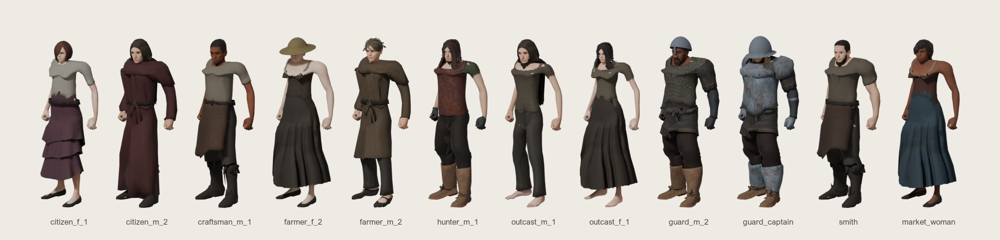
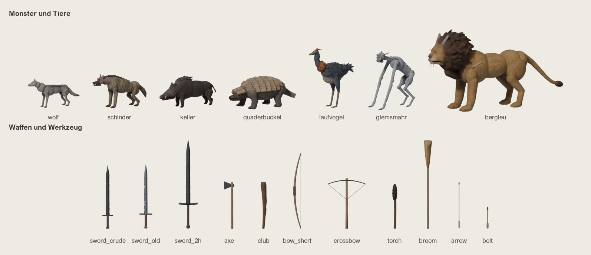

# Figuren – Stil-Referenzblatt (F3–F6)

**Stand 2026-10-08, Entwurf zur Vorlage beim Projektinhaber.** Das Blatt fasst die bisherigen Entscheidungen des
Projektinhabers (Daten in Klammern) und die Werte der vorhandenen Figuren, Monster und Gegenstände zu Regeln zusammen.
Es gilt für alles, was `figuren` baut: Menschen (F3), Animationen (F2/F4), Monster und Tiere (F5), Gegenstände (F6).
Technik und Verträge stehen in `characters-pipeline.md`, die Monster-Arten in `monsters.md`; die Werte der
einzelnen Figuren in den Manifesten (`assets/source/characters/figures/*.figure.toml`), den Stoffen
(`tools/chargen/src/gothar_chargen/data/fabrics.toml`) und den Kreatur-Beschreibungen (`data/monsters/*.creature.toml`).
Gegenstück für Gebäude und Stadt: `leonberg-stil.md`.

Große Blätter (alle Figuren vorn und hinten, alle Monster, alle Gegenstände) liegen nur lokal beim
Projektinhaber (`C:\GotharData\review\stil\`), nicht im Repo. Die Bilder zeigen den Stand mit den Stoppeln
(#274) und dem beard_head-Fix (#275), Ruhehaltung `none/s_idle`, Stufe 0.

## Leitbild
Das Spielgefühl von Gothic 1 mit eigenen Inhalten: eine raue, arme Welt um 1700 (Leonberg und das Lager). Die
Menschen sind arbeitende Leute, keine Helden; ihre Kleidung ist getragen, geflickt und schmutzig, ihr Eisen dunkel
und rostig. **Stil A, realistisch** (2026-10-03): natürliche Proportionen, Oberflächen aus Texturen (Stoff, Leder,
Haut, Fell). Überzeichnet werden nur die **Bewegungen**, damit sie aus der Third-Person-Kamera lesbar sind
(„Stil vor Realismus“ gilt für die Animation, nicht für die Körperform).

## Proportionen
- **Menschen:** MPFB2-Proportionen ohne vergrößerte Köpfe oder Hände. 1 Einheit = 1 m, Scheitelhöhe ohne Haar
  Männer 1,72–1,73 m, Frauen 1,69–1,71 m; je Geschlecht drei Staturen (dünn, mittel, schwer). Köpfe sind eigene Teile und passen auf
  jeden Grundkörper desselben Geschlechts; die Makros formen nur das Gesicht.
- **Keine Heldenkörper:** keine übertriebenen Muskeln, keine Wespentaillen. Die Rüstung der Frauen hat eine
  **neutrale Form** (`flatten = 1.0`), keinen anatomischen Harnisch.
- **Rüstung trägt auf, verkleidet aber nicht:** leicht (Leder), mittel (Kettenhemd über Tunika, gewickelte
  Hosen und Stiefel), schwer (die mittlere Linie plus Platten, kein voller Harnisch; 2026-10-03). Die Silhouette
  bleibt die eines Menschen in Arbeitskleidung mit Schutz.
- **Monster und Tiere** in echter Größe und natürlicher Anatomie, eigene Merkmale statt Fantasie-Übertreibung:
  Wolf 0,8 m Schulter, Schinder 0,9 m, Keiler 0,85 m, Quaderbuckel 1,8 m lang, Laufvogel 1,65 m hoch,
  Glemsmahr 1,5 m, Bergleu 1,6 m Schulter und 3,6 m lang (Boss, einmalig).
- **Gegenstände** in echter Größe, gemessen an der Hand des Referenz-Rigs: Einhänder ≈ 1 m, Zweihänder 1,43 m,
  Bogen 1,2 m, Fackel 0,7 m.

## Farbwelt
Gedeckt, erdig, leicht entsättigt – wie die Stadt (`leonberg-stil.md`). Stoff- und Haartexturen sind **neutral grau**
(Mittel 0,55), die Farbe kommt aus der **Palette** des Manifests; so bleibt die Farbwelt an einer Stelle steuerbar.

| Gruppe | Farbcharakter | Werte (HSV, Mittel der Paletten) | Beispiele |
|---|---|---|---|
| Bürger, Handwerker (Leonberg) | sauber, einzelne gefärbte Stoffe | Sättigung 0,36, Helligkeit 0,41–0,43 | Leinen `#efe6d2`, Beere `#7a4a5a`, Waldgrün `#2e4a3a`, Blau `#3e5a6a` |
| Bauern | ungefärbtes Leinen, Heu, Erde – die hellste Gruppe | 0,36 / 0,51 | `#ebcc9e`, `#d6c8a8`, `#5a4232` |
| Jäger | Moos, Oliv, Leder | 0,35 / 0,30 | `#5a6a44`, `#4e5a3a`, `#3e3a2a` |
| Wachen | dunkles Eisen, ein Rostrot als einziges Signal | 0,50 / 0,36 | `#6f7378`, `#5a2622`, `#6a2e28` |
| Ausgestoßene | Staub und Grau, die blasseste Gruppe | 0,28 / 0,35 (höchstens 0,33) | `#8a7e66`, `#46403a`, `#7a6e58` |

- **Grenzen:** Stoffe höchstens Sättigung 0,6; kein reines Weiß oder Schwarz. Hellster Stoff ist sauberes Leinen
  (`#f0ead8`, nur bei sauberen Figuren), dunkelstes Haar `#1e1812`, hellstes Haar Grau `#c8c4bc`.
- **Haar und Bart:** Braun-, Blond- und Grautöne; Bart und Stoppeln etwas dunkler als das Haar.
- **Leuchtende Farben sind Bedeutung:** Rot und Blau der Tränke (Heilung, Mana), Zauber und Runenzeichen. Sonst
  nichts Gesättigtes an Figuren und Gegenständen. Leuchtende Augen (`eye_glow` ≤ 0,35, blass bzw. bernsteinfarben)
  nur als Augenleuchten der Nachtjäger (Glemsmahr, Bergleu).
- **Monster:** Erd-, Stein- und Felltöne der Gegend (Sandstein beim Quaderbuckel, Gelbbraun und dunkle Mähne beim
  Bergleu); keine Signalfarben.
- **Eisen:** dunkel, leicht rostig (ambientCG „Metal 021“); Holz und Leder in warmen, mittleren Brauntönen.

## Texturdichte
- **Gleiche Fadendichte auf allen Stücken:** Die Kleidungstexturen (512²) werden aus kachelnden Stoffen gebacken,
  so oft wiederholt, dass ein Faden auf jedem Stück gleich groß ist (`gothar-chargen fabrics`).
- **Höchstgrößen** (Vertrag mit engine, `characters-pipeline.md` §2.3):

  | Was | Größe |
  |---|---|
  | Haut (Körper, Kopf) | 2048² |
  | Kleidung, Haare, Bärte | 512² (bis 1024²) |
  | Augen, Brauen, Wimpern, Zähne, Zunge | ≤ 256² |
  | Fell der Monster | 1024² Farbe, 512² Normal-Map |
  | Gegenstände | 256²; geteilte Holz-, Rinden- und Rost-Eisen-Textur 512² |

  Alle Figuren-Texturen zusammen ≤ 512 MB VRAM, je NPC ohne geteilte Haut ≈ 4–6 MB.
- **Haare, Bärte, Brauen, Wimpern, ausgefranste Säume:** Alpha **MASK** (Schwelle 0,5), nie BLEND. Feine Haare
  und Stoppeln sind auf die Nahansicht abgestimmt; engine erhält die Alpha-Bedeckung über die Mip-Stufen.
- **Geteilte Texturen:** Haut, Stoffe und Fell teilen sich die Figuren über den Namen (Tönung im Dateinamen,
  z. B. `toigo_wool_pants_bf8559.jpg`).

## Alterung
- **Kolonie: abgetragen und schmutzig** (2026-10-04). `wear` 0–1 je Kleidungstextur: verblichen (weniger
  Kontrast), Flecken, schmutzige, unregelmäßig breite Säume und Nähte.
  - Arbeits- und Lagerkleidung 0,7–0,9.
  - Leonberger Bürger 0,25 (sauber, aber nicht neu).
- **Lumpen:** ausgefranste Säume (`fray` 0,5–0,7) bei Hemden und Röcken der Ärmsten.
- **Eisen:** Rüstung und Klingen dunkel mit Rost; das alte Schwert stärker als das grobe. Zeichen fremder Quellen
  werden wegretuschiert (Brust des Kettenhemds, 2026-10-03).
- **Gegenstände** sind von Hand gemacht und benutzt: krummer Fackelstab, gewickelte Pechlumpen, abgegriffene Griffe.
- **Tiere und Monster:** Narben, verfilztes Fell, abgebrochene Zähne nach Art und Alter (Bergleu: alt und vernarbt).

## Budgets
| Was | Stufe 0 | Hinweis |
|---|---|---|
| Figur gesamt | ≤ 20 k Dreiecke | Körper + Kleidung 8–15 k; Kopf 3–5 k; typisch 13–17 k |
| Frisur / Bart / Stoppeln | 1200 / 600 / 600 | Bärte und Stoppeln mit den 15 Gesichts-Morphs |
| Kleidungsstück | ≈ 1,5 k | Kettenhemd 3 k |
| Tier, Monster | ≈ 7–8 k | Boss bis 12 k (Bergleu 11,1 k) |
| Gegenstand | ≤ 1500 | ohne Skin, ein Material je Teil |
| LOD-Stufen | Stufe 1 ≈ 50 %, Stufe 2 ≈ 20 % | Nähte bleiben in allen Stufen gleich |

## Namensregeln
- **Bezeichner Englisch, klein, mit Unterstrich;** Texte im Spiel und Doku Deutsch.
- **Gegenstände** `it_<name>` (`it_sword_old`, `it_rune_heal`), NPCs `npc_…`, Mobs `mob_…`.
- **Figuren:** `<set>_<m|f>_<n>.figure.toml` für die Sets (`citizen_m_2`), eine Rolle für benannte Figuren
  (`smith`, `guard_captain`).
- **Teile:** `parts/<art>_<m|f>_<statur oder kopf>/<stück>.glb` (`body_m_heavy`, `head_m_young`,
  `hair_m_young/beard_stubble.glb`, `cloth_m_thin`). Stücke tragen **neutrale Namen** statt der Namen der Quelle.
- **Materialien:** Das erste Wort ist die Rolle (`skin`, `cloth_<stück>`, `hair`, `beard`, `beard_head`,
  `beard_stubble`, `eyes` …). Der Palettenschlüssel ist der Materialname. Mesh-Knoten heißen `<rolle>_lod0..2`.
- **Texturen:** `textures/<kategorie>/…` (`skin`, `face`, `hair`, `cloth`, `fur`), neutrale mit `_neutral`, getönte
  mit der Farbe im Namen.
- **Monster:** eigene, deutsch klingende Namen mit Bezug zur Gegend (Schinder vom Schindanger, Glemsmahr aus Glems
  und Mahr, Bergleu vom Engelberg); Bezeichner klein ohne Umlaute.
- **Clips:** `<modus>/s_<x>` (Schleife), `t_<x>` (einmalig, Übergang; `t_<x>_in` / `t_<x>_out`), `a_<x>`
  (additive Überlagerung), Varianten `<clip>_<variante>` (`woman`, `military`, `old`, `relaxed`).

## Was wir bewusst nicht machen
- **Keine Gothic-Inhalte:** keine Assets, Skripte, Namen, Gilden-Rüstungen oder Kreaturen aus Gothic, auch keine
  Nachbildungen (ADR 0008). Gothic ist Vorbild für Stimmung und Spielgefühl; „Gothic-Richtung“ bei der schweren
  Rüstung meint den Typ (Kette plus Platten), nicht ein bestimmtes Vorbild.
- **Keine fremden Assets ohne passende Lizenz:** nur CC0 oder eigene Arbeit (das Repo ist öffentlich). Bei
  MakeHuman-Paketen den Datei-Kopf jedes Stücks prüfen (auch „CC0“-Pakete enthalten AGPL- und CC-BY-Stücke); kein
  Mixamo; Quellen und Lizenzen in `assets/LICENSES.md`.
- **Keine Marken- oder Wappen-Ähnlichkeit:** der Bergleu ist ein natürlicher Höhlenlöwe, kein Logo-Löwe; Zeichen
  fremder Quellen werden entfernt.
- **Kein Stilbruch beim Körper:** keine großen Köpfe oder Hände, keine Comic-Proportionen, keine anatomischen
  Frauenrüstungen, kein voller Plattenharnisch.
- **Keine sauberen, neuen Stoffe im Lager und keine grellen Farben** außer den bedeutungstragenden (Tränke, Magie).
- **Kein Alpha-BLEND** bei Haaren und Stoffen (Sortierung, Schatten).
- **Keine Physik für Haar, Mähne und Kleidung:** Bewegung kommt aus den Clips (die Mähne des Bergleu bewegen nur
  die Clips).
- **Noch kein eigener Vollbart:** zurückgestellt, bis es eine bessere Technik gibt (2026-10-08); bis dahin
  Stoppeln, Ziegen-, Schnurr- und Faunbart.
